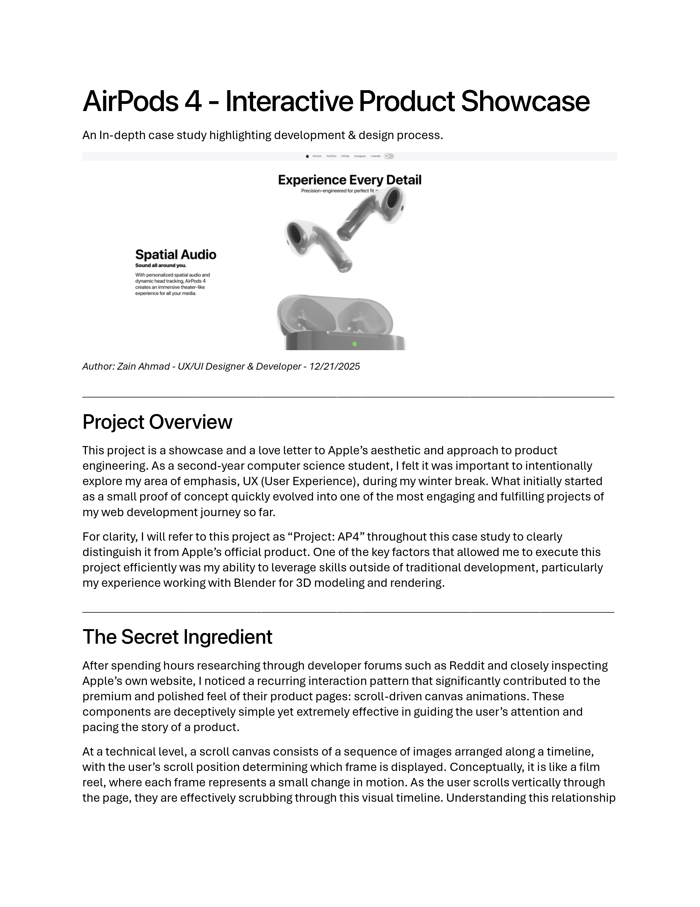
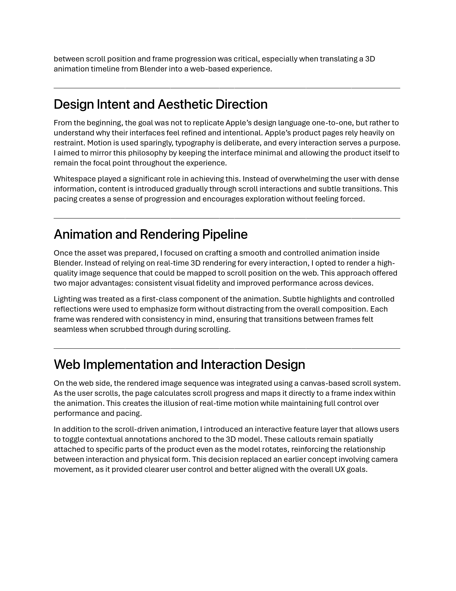
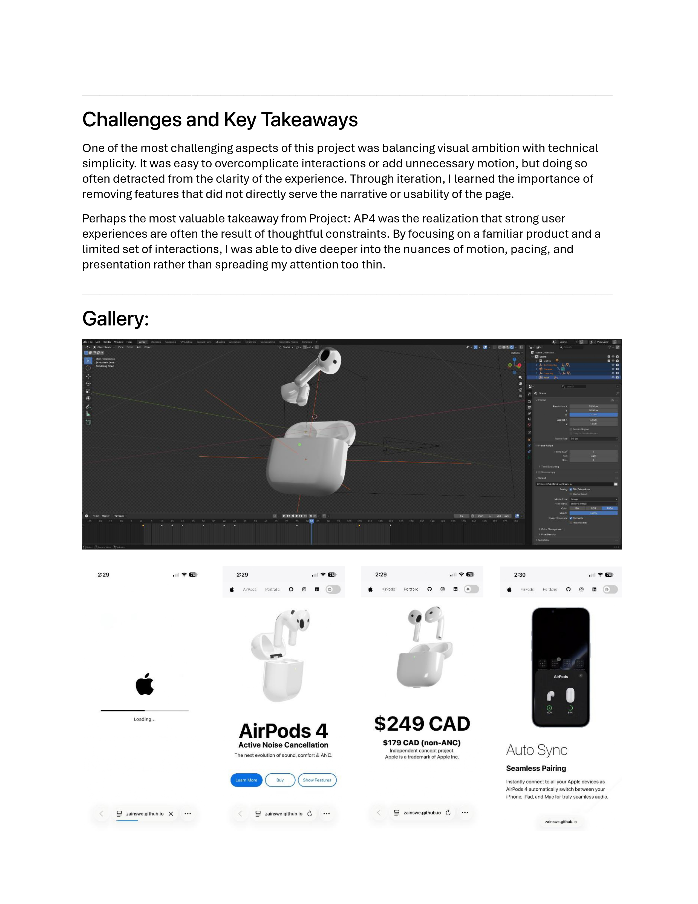

# AirPods 4 - Interactive Product Showcase

An interactive, Apple-inspired 3D product landing page featuring AirPods 4, built to explore high-quality WebGL rendering and modern product storytelling on the web.

---

## ✨ Overview

This project recreates the feel of an Apple-style product hero using real-time 3D graphics, realistic materials, and subtle motion.  
The focus is on **visual polish, performance, and restraint**.

---

## ⚡ Technologies

- **Three.js** - real-time 3D rendering
- **Vanilla JavaScript (ES6 modules)** - no frameworks
- **Custom CSS** - minimal, Apple-inspired layout
- **SF Pro fonts** - for authentic Apple typography

---

## ✨ Current Features

- Real-time 3D AirPods model with **PBR materials & lighting**
- Smooth, performance-friendly rotation animation
- Clean, centered hero layout inspired by Apple product pages
- Custom button hover & interaction states
- Responsive scaling for different viewport sizes
- Scroll-driven camera & object animations
- Full mobile optimization
- Detailed product specifications

---

## 🛠️ Planned Features

- Graceful fallback for low-end devices

---

## 🤔 Why This Project?

I built this project to **deepen my Three.js and WebGL skills** while studying how Apple balances minimalism, motion, and product storytelling.

I plan to publish a detailed blog post breaking down:
- lighting & material choices
- scene optimization decisions
- animation techniques
- how to achieve an “Apple-like” feel without overdesigning

---

## 📖 Case Study

Below is an in-depth breakdown of the design and development process behind this project.

### Page 1

---

### Page 2

---

### Page 3

---

## 🌐 Live Demo

🔗 https://zainswe.github.io/airpods4/

